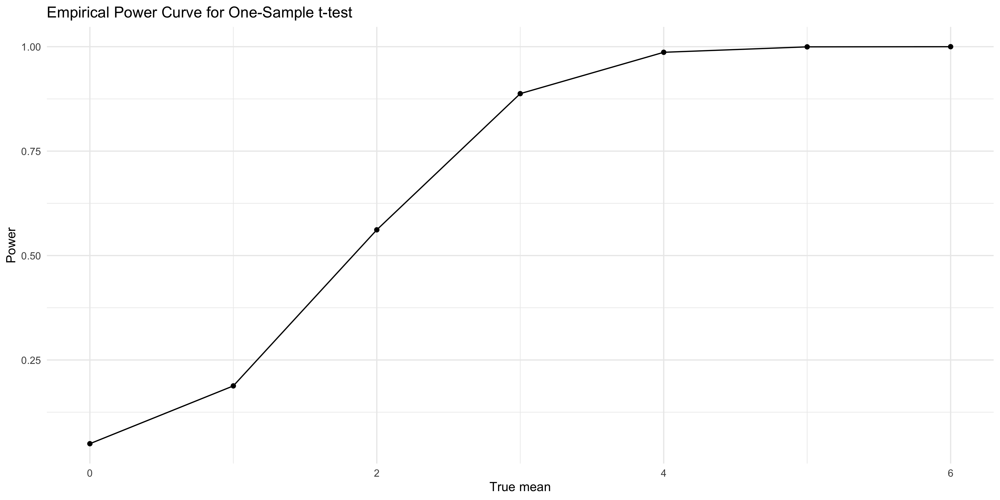
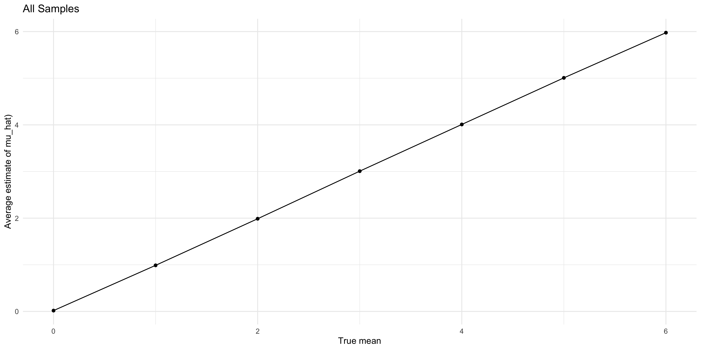
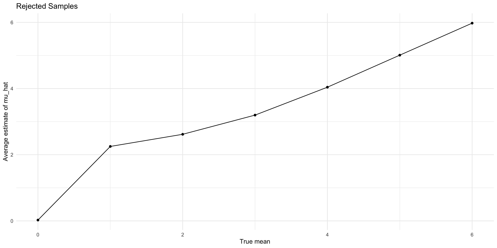
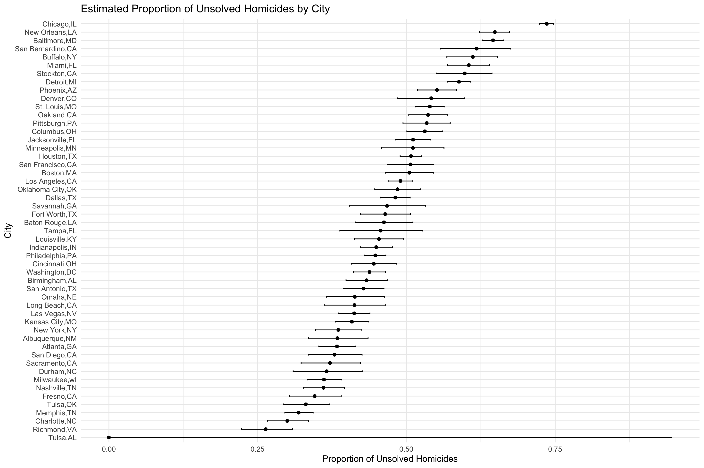

p8105_hw5_dx2262
================

Load packages.

``` r
library(tidyverse)
```

    ## ── Attaching core tidyverse packages ──────────────────────── tidyverse 2.0.0 ──
    ## ✔ dplyr     1.1.4     ✔ readr     2.1.5
    ## ✔ forcats   1.0.0     ✔ stringr   1.5.1
    ## ✔ ggplot2   4.0.0     ✔ tibble    3.2.1
    ## ✔ lubridate 1.9.4     ✔ tidyr     1.3.1
    ## ✔ purrr     1.0.4     
    ## ── Conflicts ────────────────────────────────────────── tidyverse_conflicts() ──
    ## ✖ dplyr::filter() masks stats::filter()
    ## ✖ dplyr::lag()    masks stats::lag()
    ## ℹ Use the conflicted package (<http://conflicted.r-lib.org/>) to force all conflicts to become errors

``` r
library(broom)
```

## Problem 2

``` r
sim_results_df <- 
  expand_grid(
    mu = 0:6, 
    iter = 1:5000
  ) %>%
  mutate(
    x = map(mu, ~ rnorm(30, mean = .x, sd = 5)),
    ttest = map(x, ~ t.test(.x, mu = 0)),
    tidy = map(ttest, tidy)
  ) %>%
  unnest(tidy) %>%
  select(
    mu,
    iter,
    estimate, 
    p_value = p.value
  )
```

Make plots.

``` r
sim_results_df %>%
  group_by(mu) %>%
  summarize(power = mean(p_value < 0.05)) %>% 
  ggplot(aes(x = mu, y = power)) +
  geom_point() +
  geom_line() +
  labs(
    x = "True mean",
    y = "Power",
    title = "Empirical Power Curve for One-Sample t-test"
  ) +
  theme_minimal()
```

<!-- -->

The farther mu is from 0 (effect size grows), the more often the test
correctly rejects the null.

``` r
est_summary <- 
  sim_results_df %>%
  group_by(mu) %>%
  summarize(
    mean_est = mean(estimate),
    mean_est_rejected = mean(estimate[p_value < 0.05]),
    .groups = "drop"
  )
```

``` r
est_summary %>% 
  ggplot(aes(x = mu, y = mean_est)) +
  geom_point() +
  geom_line() +
  labs(
    x = "True mean",
    y = "Average estimate of mu_hat)",
    title = "All Samples"
  ) +
  theme_minimal()
```

<!-- -->

``` r
est_summary %>% 
  ggplot(aes(x = mu, y = mean_est_rejected)) +
  geom_point() +
  geom_line() +
  labs(
    x = "True mean",
    y = "Average estimate of mu_hat",
    title = "Rejected Samples"
  ) +
  theme_minimal()
```

<!-- -->

The sample average of mu_hat across tests for which the null is rejected
does not equal to the true value of mu when mu is small. This is because
we have conditioned on having rejected null, selecting only samples
whose means were far enough from 0 to cross the significance threshold.
This artificially inflates the average estimate.

## Problem 3

``` r
homicide_data <- 
  read_csv("data/homicide-data.csv") %>% 
  janitor::clean_names() %>% 
  drop_na()
```

    ## Rows: 52179 Columns: 12
    ## ── Column specification ────────────────────────────────────────────────────────
    ## Delimiter: ","
    ## chr (9): uid, victim_last, victim_first, victim_race, victim_age, victim_sex...
    ## dbl (3): reported_date, lat, lon
    ## 
    ## ℹ Use `spec()` to retrieve the full column specification for this data.
    ## ℹ Specify the column types or set `show_col_types = FALSE` to quiet this message.

Create city_state variable.

``` r
homicide_data <- 
  homicide_data %>% 
  mutate(
    city_state = str_c(city, state, sep = ",")
  )
```

Total number of homicides, unsolved homicides.

``` r
homicide_data %>% 
  group_by(city_state) %>% 
  summarize(
    total_homicides = n(),
    unsolved_homicides = sum(disposition %in% c("Closed without arrest", "Open/No arrest"))
  )
```

    ## # A tibble: 51 × 3
    ##    city_state     total_homicides unsolved_homicides
    ##    <chr>                    <int>              <int>
    ##  1 Albuquerque,NM             375                144
    ##  2 Atlanta,GA                 973                373
    ##  3 Baltimore,MD              2827               1825
    ##  4 Baton Rouge,LA             424                196
    ##  5 Birmingham,AL              799                346
    ##  6 Boston,MA                  612                309
    ##  7 Buffalo,NY                 520                318
    ##  8 Charlotte,NC               687                206
    ##  9 Chicago,IL                5535               4073
    ## 10 Cincinnati,OH              694                309
    ## # ℹ 41 more rows

Unsolved homicides in the city of Baltimore, MD.

``` r
balt <- 
  homicide_data %>% 
  filter(city_state == "Baltimore,MD") %>% 
  summarize(
    total = n(),
    unsolved = sum(disposition %in% c("Closed without arrest", "Open/No arrest"))
  )

pt <- prop.test(pull(balt, unsolved), pull(balt,total))
pt_tidy <- tidy(pt)

pull(pt_tidy, estimate)
```

    ##         p 
    ## 0.6455607

``` r
pull(pt_tidy, conf.low)
```

    ## [1] 0.6275625

``` r
pull(pt_tidy, conf.high)
```

    ## [1] 0.6631599

Each of the cities in the dataset.

``` r
city_results <- 
  homicide_data %>%
  group_by(city_state) %>%
  summarize(
    total = n(),
    unsolved = sum(disposition %in% c("Closed without arrest", "Open/No arrest")),
    .groups = "drop"
  ) %>%
  mutate(
    prop_test = map2(unsolved, total, ~prop.test(.x, .y))
  ) %>%
  mutate(
    prop_tidy = map(prop_test, tidy)
  ) %>%
  unnest(prop_tidy) %>%
  select(
    city_state,
    estimate,
    conf.low,
    conf.high
  )
```

    ## Warning: There was 1 warning in `mutate()`.
    ## ℹ In argument: `prop_test = map2(unsolved, total, ~prop.test(.x, .y))`.
    ## Caused by warning in `prop.test()`:
    ## ! Chi-squared approximation may be incorrect

``` r
city_results
```

    ## # A tibble: 51 × 4
    ##    city_state     estimate conf.low conf.high
    ##    <chr>             <dbl>    <dbl>     <dbl>
    ##  1 Albuquerque,NM    0.384    0.335     0.436
    ##  2 Atlanta,GA        0.383    0.353     0.415
    ##  3 Baltimore,MD      0.646    0.628     0.663
    ##  4 Baton Rouge,LA    0.462    0.414     0.511
    ##  5 Birmingham,AL     0.433    0.398     0.468
    ##  6 Boston,MA         0.505    0.465     0.545
    ##  7 Buffalo,NY        0.612    0.568     0.653
    ##  8 Charlotte,NC      0.300    0.266     0.336
    ##  9 Chicago,IL        0.736    0.724     0.747
    ## 10 Cincinnati,OH     0.445    0.408     0.483
    ## # ℹ 41 more rows

Create a plot.

``` r
city_results %>%
  arrange(estimate) %>%
  mutate(
    city_state = factor(city_state, levels = city_state)
  ) %>%
  ggplot(aes(x = city_state, y = estimate)) +
  geom_point() +
  geom_errorbar(aes(ymin = conf.low, ymax = conf.high), width = 0.2) +
  coord_flip() + 
  labs(
    x = "City",
    y = "Proportion of Unsolved Homicides",
    title = "Estimated Proportion of Unsolved Homicides by City"
  ) +
  theme_minimal()
```

<!-- -->
